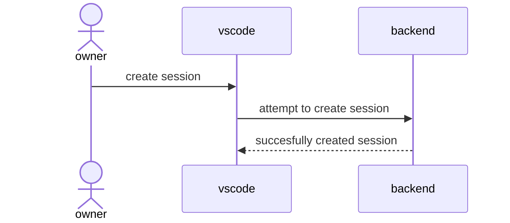
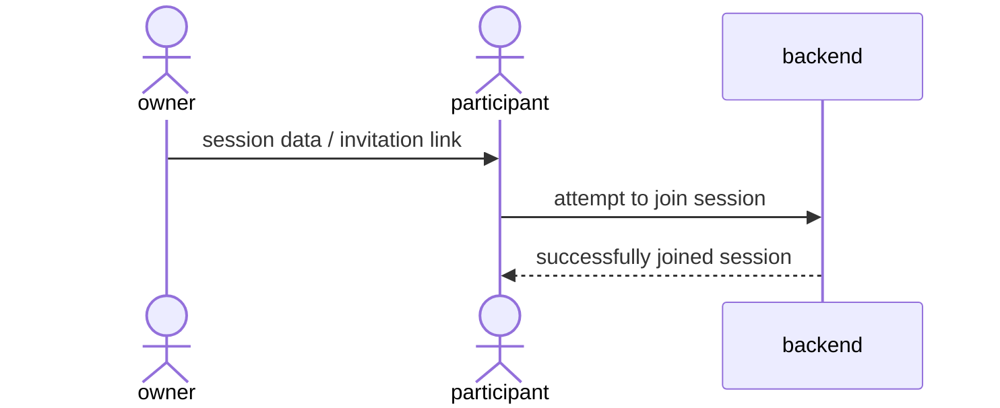
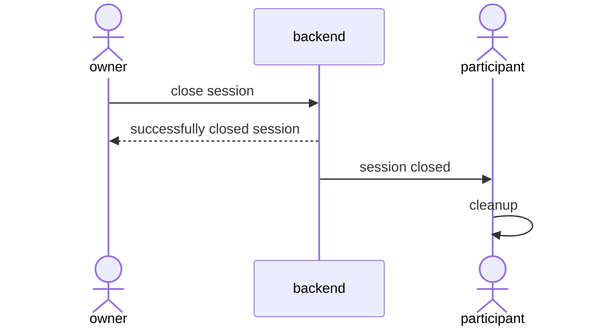
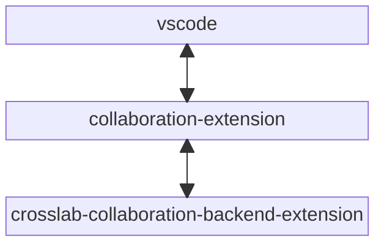

# Scenarios

There are a two main scenarios for collaborative editing. Each of them require a different approach:

- a user wants to share his local project
- users want to collaborate on a shared project

## Sharing a local project

When a user wants to share a local project he needs to create a new session. After this session is created he can invite other users to join his session. For each joining user the project is mirrored on their end. If the owner of the session allows it the other participants may edit his files. Otherwise they will be readonly for the other participants. Each change needs to be reflected on the local filesystem of the owner. The session ends as soon as the owner either leaves or closes it.

### Starting a session

In order to start a new session a user needs to have some sort of backend for the session management (e.g. a simple websocket server). The user will send a create request to this server. The backend will signal the result of this create request to the user.

### Joining a session

In order for other users to join a collaborative session, they need to know where to connect to. They can either use the parameters that where used to create the session (e.g. session name and password) or an invitation link could be created. If the backend supports invitation links it should send them alongside the response to a create request. Upon successfully joining a session the current state of all documents will be replicated on the joining user's side.

### Closing a session

When the owner leaves the session or closes it the session will automatically end for all participants.

## Accessing a shared project (CRDT)

A shared project is special in the sense that all participants share the same document and can apply changes to it without needing to be connected to any other participants. Once participants connect to each other all their local changes should be merged together. When using CRDTs the merging process itself will always be successfuly, however there are still some problems which may occur:

- filesystem operations (creating, moving or deleting files and folders)
- general merging problems in single files (e.g. one participant edited a function the other one deleted)

One possible solution for this problem is to save the last offline state of each user before merging. These saved versions should be visible for all participants. Furthermore they should be readonly. This way the users can resolve merge errors themselves by comparing their last offline versions. Such a snapshot could be saved everytime a participant connects with another participant or when a new participant joins the session.

### Creating a shared project

At first one user must create a new session and specify that a new shared project should be created. Each user that joins the session will also get a copy of the shared project. Shared projects will be saved in a separate location from all other projects (e.g. in a special idb-store).

### Creating / Joining a session

Once someone has access to a shared project he can open / join a session for it at any time. Creating and joining a session can almost be viewed as one and the same operation. Once another participant enters the session all changes will be merged automatically and a snapshot of the last version before merging will be saved for each participant. These snapshots will be shared among all participants (there should most likely be a limit on the amount of snapshots per participants). The snapshots are readonly and will only be deleted once they reach a certain threshold (per participant). 

### Leaving a session

A participant may leave a session at any time. The document should stay open afterwards but the connection should be closed and the synchronization should be stopped.

## Accessing a shared project (OT)

When using operational transformation each participant needs to be connected to the server in order to ensure, that each local change is applied to the remote document. Most of the steps are the same as when using the CRDT-based approach, however there is no need to account for offline edits since those would not be allowed. Instead the backend would have the additional task of managing shared projects.

## Adapting the idea to CrossLab

- shared experiments?
- crdt -> signaling + corresponding connector
- ot -> cloud instantiable device (or concrete device)
- set vscode settings based on devices in experiment (or if standalone) could be done via apis exported from extensions (api = return value from activate function)

## Additional ideas

- logging code edits of students
- git approach to collaboration? (commit offline changes, online changes are committed to new branch)
- debugging synchronisation
- compile and upload synchronisation

