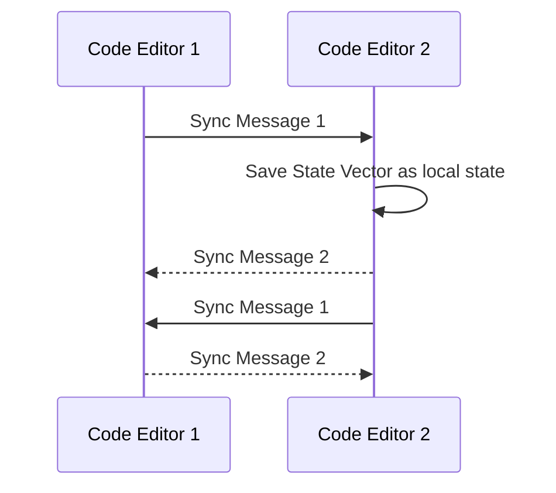

# CrossLab Collaboration Service

The CrossLab collaboration service should allow devices to share realtime information among each other. One example for this would be collaborative realtime code editing. For this the content of directories along with their contained files would need to be synced between clients. Furthermore information about the location of cursors and the current state of the editor could be shared (e.g. if another user is currently compiling).

Devices should announce the schema of their shared resources. This would allow devices to validate the shared resources. There are also many different options for implementing the data sharing between devices. The different techniques include Operational Transformation (OT), Differential Synchronization and Conflict-free Replicated Data Types (CRDTs). It should be possible to choose the implementation best fitting for the system to be implemented. Furthermore it should be possible for resources to be shared in a readonly way, where only the owner of the resource can edit them, while other participants can only observe the changes made.

##

To allow devices to share resources they can define different "rooms" in their configuration. These rooms can then be used in connections between devices to interconnect them. Both devices need to use the same collaboration provider (e.g. yjs). An example configuration is given below.

```typescript
const experimentConfiguration = {
  devices: [
    {
      device: "https://api.example.de/devices/0",
      role: "code-editor",
    },
    {
      device: "https://api.example.de/devices/1",
      role: "code-editor",
    },
  ],
  roles: [
    {
      name: "code-editor",
      configuration: {
        collaboration: {
          projects: {
            schema: {
              type: "array",
              items: {
                anyOf: [
                  {
                    type: "object",
                    properties: {
                      name: { type: "string" },
                      content: { type: "string" },
                    },
                  },
                  {
                    $ref: "#",
                  },
                ],
              },
            },
          },
          variables: {
            type: "object",
            properties: {
              isCompiling: { type: "boolean" },
            },
          },
        },
      },
    },
  ],
  serviceConfigurations: [
    {
      serviceType: "https://api.example.de/serviceTypes/collaboration",
      participants: [
        {
          role: "code-editor",
          serviceId: "collaboration",
          config: {
            provider: "yjs",
            rooms: ["projects", "variables"],
          },
        },
      ],
    },
  ],
};
```

## Yjs Collaboration

In the following Example Code Editor 1 shares its projects with Code Editor 2.


