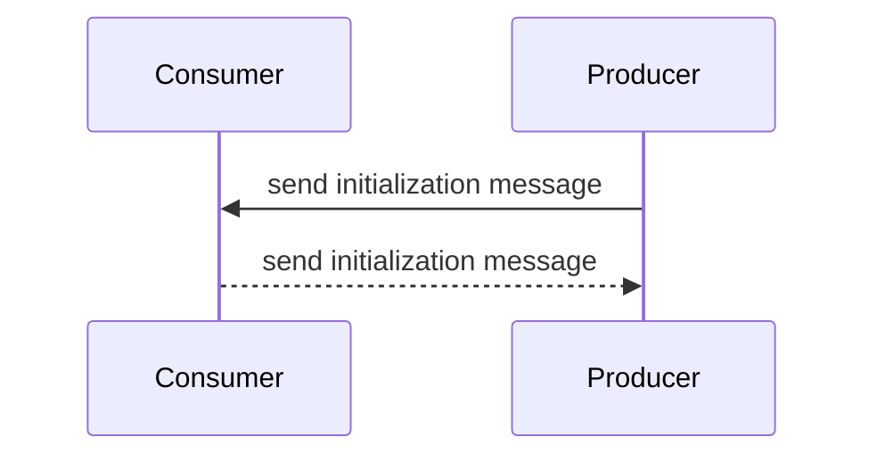
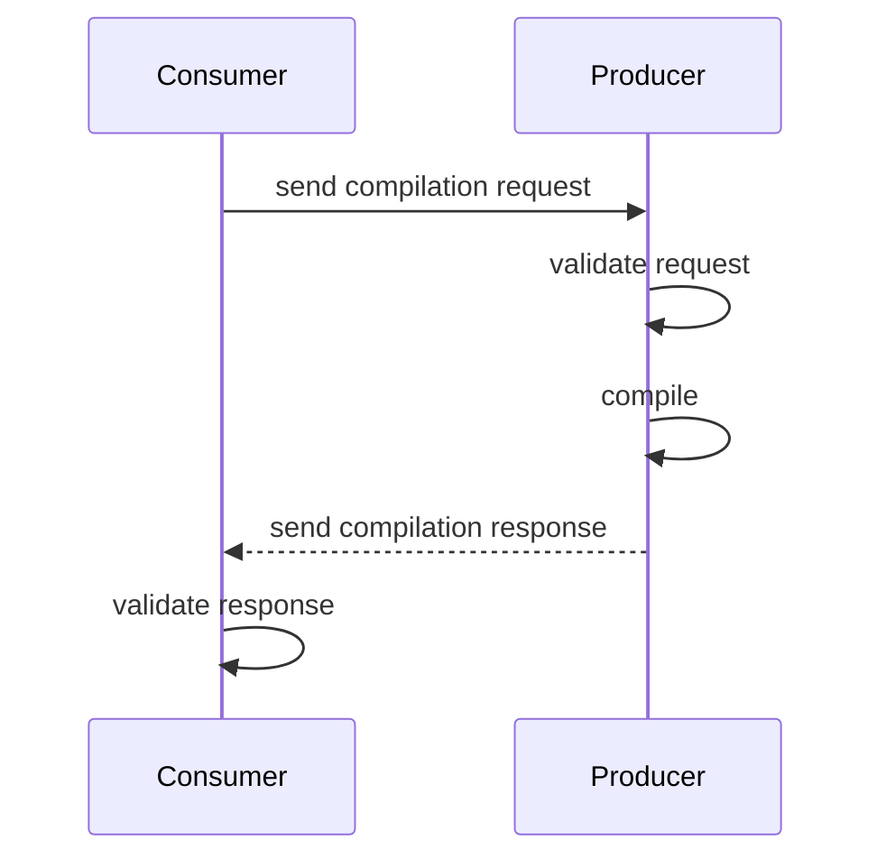

# CrossLab Compilation Service

There are two CrossLab Compilation Services, a consumer and a producer.

## Types

These are the important types for the CrossLab Compilation Service:

```ts
type File = {
  type: "file";
  name: string;
  content: Uint8Array;
};

type Directory = {
  type: "directory";
  name: string;
  content: (File | Directory)[];
};

type CompilationResultFormat = {
  id: string;
  result: Omit<File, "content"> | Omit<Directory, "content">;
};

type CompilationResult = {
  format: string;
  result: File | Directory;
};

type CompilationRequest = {
  requestId: string;
  format?: string;
  directory: File | Directory;
};

type CompilationResponse =
  | {
      requestId: string;
      success: true;
      message?: string;
      format: string;
      result: File | Directory;
    }
  | {
      requestId: string;
      success: false;
      message?: string;
    };

type CompilationServiceConfiguration = {
  compiler: string;
  format: string;
};

type CompilationServiceConsumerConfiguration = {
  languages?: string[];
  formats?: string[];
};

type CompilationServiceProducerConfiguration = {
  formats?: CompilationResultFormat[];
};
```

## Consumer

The consumer has the following interface:

```ts
interface CrossLabCompilationServiceConsumer {
  sendCompilationRequest: (
    request: CompilationRequest
  ) => Promise<CompilationResponse>;
}
```

## Producer

The producer has the following interface:

```ts
interface CrossLabCompilationServiceProducer {
  onCompilationRequest: (
    request: CompilationRequest
  ) => Promise<CompilationResponse>;
}
```

## Service Interaction

### Initialization



### Compilation


