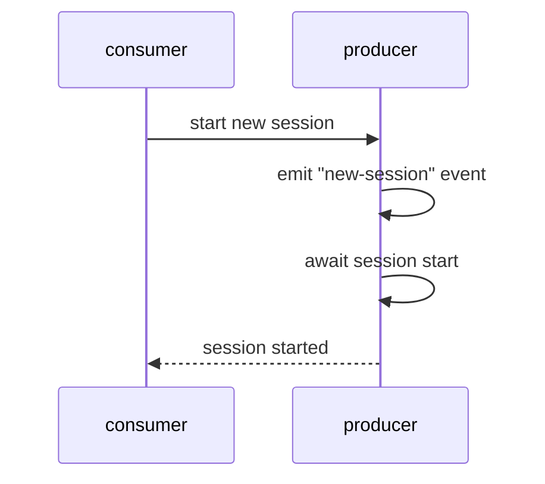
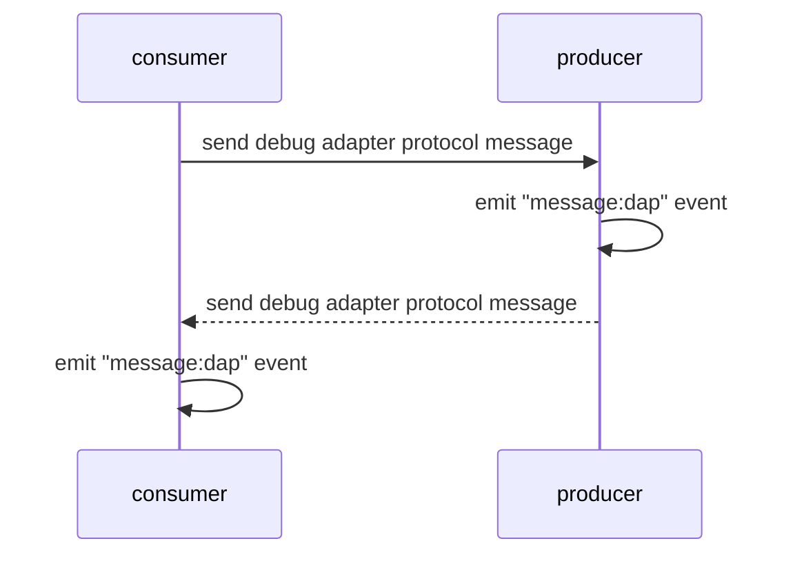
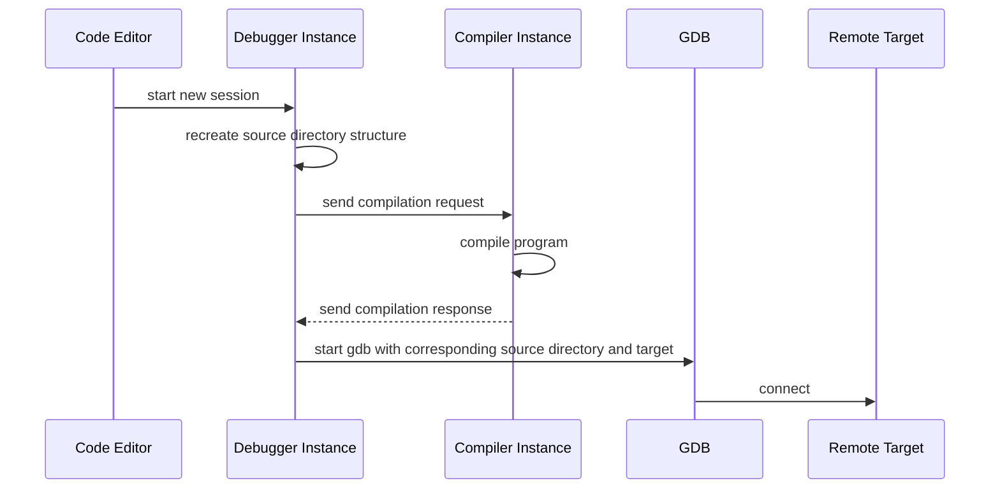

# Debugging

- [Services](#services)
  - [Session Start](#session-start)
  - [Message Exchange](#message-exchange)
- [Server](#server)
  - [Start Debug Session](#start-debug-session)
- [Extension](#extension)

## Services

The debugging service is implemented in two parts: one consumer and one producer.

### Session Start

### Message Exchange

## Server

### Start Debug Session

## Extension
