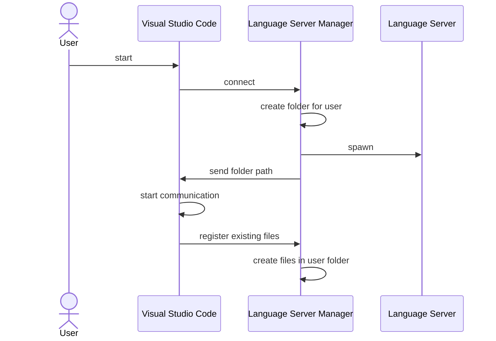
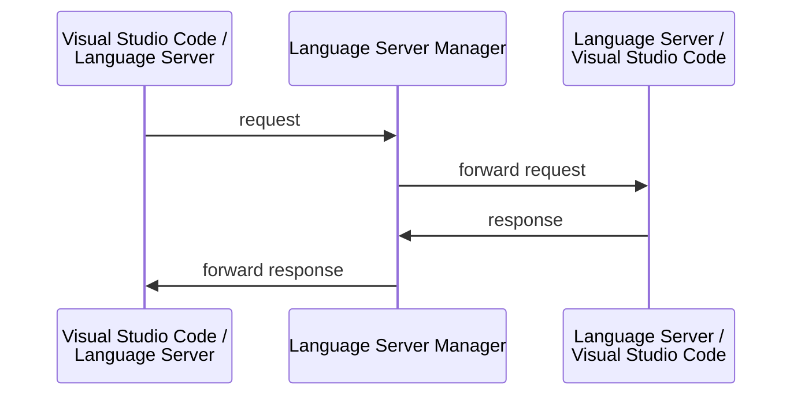
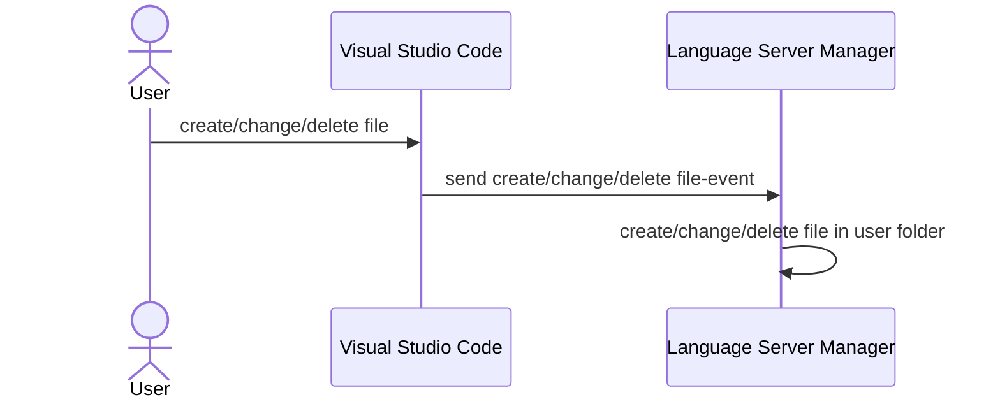
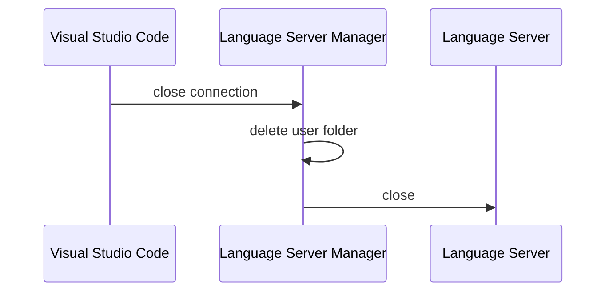

# Extension

Im Verlauf der Arbeit sollen mehrere Extension konzipiert werden, welche die gewünschten Funktionen in Visual Studio Code ermöglichen. Diese Extensions sollen die folgenden Funktionen bereitstellen:

- Nutzer sollen in der Lage sein ihre Projekte im Browser speichern zu können
- Nutzer sollen in der Lage sein ihren Quellcode kompilieren zu können
- Nutzer sollen in der Lage sein ihr kompiliertes Programm auf eine verfügbare Steuereinheit hochladen zu können
- Nutzer sollen in der Lage sein ihre Projekte mit anderen Nutzern innerhalb eines Experiments teilen zu können
- Nutzer sollen in der Lage sein ihr Programm in einem Debug-Modus starten zu können
- Es soll pro Steuereinheit in einem Experiment nur ein simultaner Kompiliervorgang erlaubt sein
- Es soll pro Steuereinheit in einem Experiment nur eine simultane Debug-Session erlaubt sein
- Es soll pro Steuereinheit in einem Experiment nur ein simultaner Uploadvorgang erlaubt sein
- Der Nutzer soll mithilfe eines Language Servers unterstützt werden

Während der Arbeit werden die Extensions entwickelt mit dem Ziel die Programmierung von Microcontrollern für die Nutzer des GOLDi Remotelab zu vereinfachen. Dabei wird von einem Microcontroller Board des GOLDi Remotelab ausgegangen. Diese bestehen aus einem Raspberry Pi Compute Module 4, einem FPGA und einem Atmega2560 Microcontroller. Das Compute Module übernimmt die Kommunikation des Systems mit der CrossLab Infrastruktur. Der FPGA dient als Schnittstelle zwischen dem Compute Module und dem Microcontroller. Weiterhin wird das 3-Achs-Portal als Beispiel für ein steuerbares elektromechanisches Modell genommen. Unter Berücksichtigung der virtuellen Varianten dieser Laborgeräte gibt es somit vier verschiedene mögliche Experimentkonfigurationen, welche betrachtet werden sollen:

1. Realer Microcontroller und reales 3-Achs-Portal
2. Realer Microcontroller und virtuelles 3-Achs-Portal
3. Virtueller Microcontroller und reales 3-Achs-Portal
4. Virtueller Microcontroller und virtuelles 3-Achs-Portal

Weiterhin ist zu beachten, dass ein Experiment auch mehrere verschiedene Steuereinheiten beinhalten kann.

## Dateisystem

Die Konzipierung einer Extension zur Bereitstellung eines eigenen Dateisystems ist nötig, da nicht alle Browser die von Visual Studio Code Web verwendete File System API vollständig implementieren. Als Alternative zur persistenten Speicherung von Daten im Browser bietet sich die IndexedDB API an. Daher wird diese als Grundlage für die zu konzipierende Extension verwendet. Um ein neues Dateisystem in Visual Studio Code bereitzustellen kann die `FileSystemProvider` API genutzt werden. Mithilfe dieser kann ein eigener `FileSystemProvider` implementiert werden, wodurch die typischen Funktionen eines Dateisystems bereitgestellt werden können. Weiterhin bietet Visual Studio Code noch die `FileSearchProvider` API und die `TextSearchProvider` API an. Durch die Implementierung ersterer können Nutzer innerhalb des neuen Dateisystems nach Dateien suchen, während die Implementierung zweiterer das Durchsuchen des Inhalts der Dateien ermöglicht. Beide dieser APIs befinden sich aktuell noch im Stadium `proposed`, allerdings wird aktuell aktiv an ihrer Finalisierung gearbeitet. Extensions, die APIs im `proposed` Stadium verwenden können nicht auf dem Marketplace bereitgestellt werden. Jedoch überwiegen die Vorteile der APIs diesen Nachteil im Hinblick auf den Einsatz der Extension im GOLDi Remotelab. Die Dateisystem Extension besteht also aus den folgenden Teilen:

- `FileSystemProvider`
- `FileSearchProvider`
- `TextSearchProvider`

## Kompilierung

Bei der Kompilierung der Projekte kann die Lösung abhängig von der Experimentkonfiguration sein. Bei einem Experiment mit einem realen Microcontroller könnte die Kompilierung von dem Compute Module übernommen werden. Bei einem Experiment mit einem virtuellen Microcontroller ist allerdings eine andere Herangehensweise nötig. Hierbei könnte ein separater Kompilierserver genutzt werden. Dieser könnte als ein Cloud-instanziierbares Gerät eingebunden werden. Um die Kompilierung für den Nutzer einfach zu gestalten muss eine entsprechende Extension konzipiert werden, die in entsprechenden Dateien eine Aktionstaste zum Kompilieren hinzufügt. Eine entsprechende Datei könnte unter anderem die folgenden Eigenschaften besitzen:

- liegt im GOLDi-Dateisystem
- hat Dateiendung .c

Allgemein ist noch zu beachten, dass die verantwortlichen Geräte einen entsprechenden Service anbieten müssen. Hierbei könnte ggf. ein `FileService` verwendet werden. Dabei würde zunächst das Projekt als Datei encodiert werden. Danach würde diese Datei an das für die Kompilierung zuständige Gerät gesendet werden. Dort angekommen wird das Projekt kompiliert und das Ergebnis dieses Vorgangs wird dann zurück an den Anfragenden gesendet.

## Upload

Der Upload des kompilierten Programms muss im Falle eines realen Microcontrollers über das Compute Module geschehen. Bei einem virtuellen Microcontroller sollte dies direkt mit integriert sein. In beiden Fällen bietet sich ein `FileService` zur Übertragung des Programms an. Weiterhin könnte zusätzlich ein `MessageService` eingesetzt werden um den Status eines Uploads an den Nutzer weiterleiten zu können.

## Debugging

Im Falle eines realen Microcontrollers sollte das Debugging durch das Compute Module bereitgestellt werden. Hierbei könnten die Programme OpenOCD und gdb verwendet werden. Bei virtuellen Microcontrollern ist das Debugging etwas schwieriger. Man könnte einen ähnlichen Ansatz wie Wokwi verfolgen. Diese haben ein eigenes Betriebssystem Image für v86 gebaut, welches gdb beinhaltet. v86 emuliert eine x86-kompatible CPU ("The instruction set is around Pentium 4 level, including full SSE3 support"). Wenn ein Nutzer in Wokwi einen Microcontroller debuggen möchte, so wird ein neues Browser-Fenster mit einer gdb Instanz, welche in v86 ausgeführt wird, geöffnet. Allerdings wäre es für den Nutzer angenehmer, wenn das bereits vorhandene Debugging Frontend von Visual Studio Code verwendet werden könnte. Dazu kann gdb im Debug Adapter Protocol Modus ausgeführt werden. Dabei ist jedoch zu beachten, dass es ggf. zu Performanzproblemen kommen könnte, wenn der Emulationsansatz verfolgt wird. Ansonsten könnte ggf. auch hier eine Server-basierte Lösung genutzt werden. In jedem Fall wird jedoch eine Extension für Visual Studio Code benötigt, die den Debugger anbindet. Dabei muss zunächst noch überprüft werden, ob eine Einbindung einer derartigen Extension in die Web Version von Visual Studio Code überhaupt erfolgen kann. Zudem muss das zuständige Gerät auch einen entsprechenden Service implementieren.

Für Debugging von avr8js muss ein entsprechender gdb-server implementiert werden (siehe z.B. https://github.com/buserror/simavr/blob/master/doc/manual/manual.pdf). Ansonsten besteht auch die Möglichkeit Instanzen von simulavr oder simavr bereitzustellen. Beide dieser Simulationen unterstützen gdb.

## Language Server

Um einen Language Server anzubinden könnte man einerseits versuchen, eine WebAssembly Version des clangd Language Servers zu verwenden, oder man setzt auch hier auf eine Server-basierte Lösung. In jedem Fall muss aber eine Extension für Visual Studio Code geschrieben werden, die den Language Server einbindet. Außerdem muss das zuständige Gerät noch einen entsprechenden Service bereitstellen.

### Instanziierung

### Kommunikation

### Datei Events

### Verbindungsabbau

## Crosslab Kompatibilität

Es sollte noch eine Crosslab Extension entwickelt werden. Diese könnte eine API anbinden, welche es den anderen Extensions ermöglicht ihre Services anzumelden.

## Blockbild Reale Steuereinheit

/real-cu.png>)

## Blockbild Virtuelle Steuereinheit

/virtual-cu.png>)
