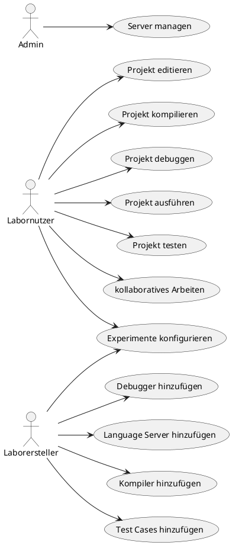

# Use Cases

```plantuml
@startuml

left to right direction

:Labornutzer: as LB
:Laborersteller: as LE
:Admin: as A

LB --> (Projekt editieren)
LB --> (Projekt kompilieren)
LB --> (Projekt debuggen)
LB --> (Projekt ausführen)
LB --> (Projekt testen)
LB --> (kollaboratives Arbeiten)
LB --> (Experimente konfigurieren)

LE --> (Debugger hinzufügen)
LE --> (Language Server hinzufügen)
LE --> (Kompiler hinzufügen)
LE --> (Test Cases hinzufügen)
LE --> (Experimente konfigurieren)

A --> (Server managen)

@enduml
```