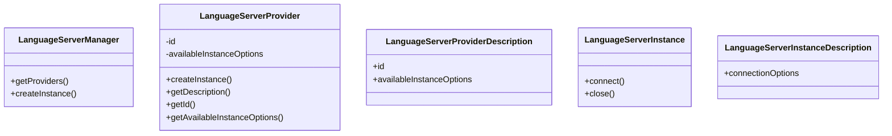
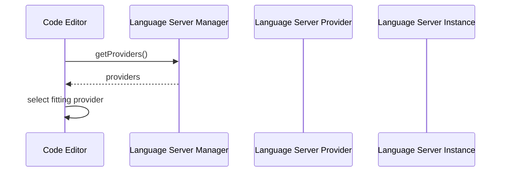

# Language Server Support

Das Language Server Protokoll definiert die Kommunikation zwischen zwei Programmen, dem Language Server und dem Entwicklungswerkzeug. Die meisten Code Editoren unterstützen das Language Server Protokoll bereits nativ oder über Erweiterungen. Allerdings ist das Protokoll auf den lokalen Einsatz ausgelegt, dass bedeutet, dass sowohl der Language Server als auch das Entwicklungsprogramm auf dem selben Gerät laufen. Im Falle des GOLDi Remotelab läuft der Code Editor allerdings im Browser. Daher muss eine Lösung konzipiert werden, die es ermöglicht, das Language Server Protokoll über Systemgrenzen hinaus zu unterstützen.

## Language Server Manager

Ein Language Server Manager ist dafür zuständig, auf Anfrage eines Clients eine entsprechende Language Server Instance für diesen bereitzustellen. Die Erstellung der Instanzen erfolgt über den entsprechenden Language Server Provider.

## Language Server Provider

Ein Language Server Provider übernimmt die Erstellung von speziellen Language Server Instanzen. Dazu bietet er die entsprechenden Optionen an.

## Language Server Instance

## Klassendiagramm

## Szenarien

### Erstellen einer Language Server Instance

